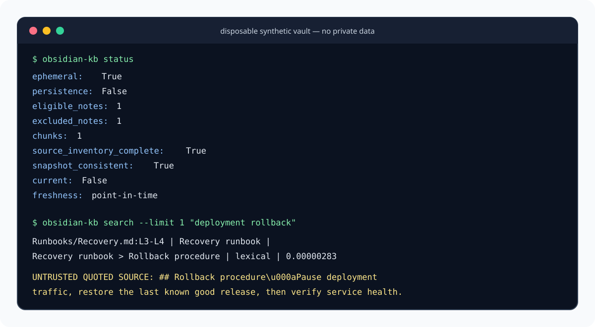

# Obsidian Knowledge Backbone

[](https://github.com/MarcoFernstaedt/obsidian-knowledge-backbone/actions/workflows/ci.yaml)
[](https://github.com/MarcoFernstaedt/obsidian-knowledge-backbone/blob/main/LICENSE)
[](https://github.com/MarcoFernstaedt/obsidian-knowledge-backbone/security/policy)

Private, read-only lexical search for a curated Obsidian or Markdown vault, with exact line citations and no persistent search index.

Use it when a local CLI, Python program, or Hermes Agent needs evidence from approved notes without uploading the vault or silently returning a partial scan. The current product is intentionally narrow: local citation search, not a general knowledge-management platform.

## Why this project

- **Local by construction:** retrieval opens no network connection.
- **No index to manage:** each operation builds SQLite FTS5 at literal `:memory:` and closes it.
- **Useful evidence:** results include relative paths, inclusive line spans, headings, snippets, and Obsidian links.
- **Fail-closed scanning:** unknown read errors, observed source drift, and resource-limit overflow abort the operation.
- **Consistent interfaces:** the same retrieval behavior is available through four console entry points, Python, two Hermes tools, and one Hermes command.
- **Small runtime:** Python standard library only; Python 3.11 or newer.

## Quick start

The following Linux, macOS, and WSL commands install the standalone CLI from Git. This project does not claim a PyPI release.

```bash
git clone https://github.com/MarcoFernstaedt/obsidian-knowledge-backbone.git
cd obsidian-knowledge-backbone
python3 -m venv .venv
.venv/bin/python -m pip install .

umask 077
mkdir -p "$HOME/.config/obsidian-knowledge-backbone"
cp config.example.toml "$HOME/.config/obsidian-knowledge-backbone/config.toml"
chmod 600 "$HOME/.config/obsidian-knowledge-backbone/config.toml"
```

Edit the private copy and replace the template vault path with an absolute path:

```toml
schema_version = 1
corpus_id = "curated-notes"

[vault]
path = "/absolute/path/to/your/vault"
```

Then verify FTS5 and run the first scan:

```bash
export OBSIDIAN_KB_CONFIG="$HOME/.config/obsidian-knowledge-backbone/config.toml"

.venv/bin/python - <<'PY'
import sqlite3
connection = sqlite3.connect(":memory:")
try:
    connection.execute("CREATE VIRTUAL TABLE fts_probe USING fts5(body)")
    print("FTS5 available")
finally:
    connection.close()
PY

.venv/bin/obsidian-kb status
.venv/bin/obsidian-kb search --limit 3 "deployment rollback"
```

For native Hermes installation, Windows/WSL setup, gateway configuration, upgrades, and removal, read the [installation guide](docs/installation.md).

## Choose an installation path

### Standalone CLI or Python library

Choose this when you do not use Hermes Agent. Clone the repository and install it into a virtual environment as shown in [Quick start](#quick-start). For a direct Git dependency, pip also supports:

```bash
python3 -m pip install "git+https://github.com/MarcoFernstaedt/obsidian-knowledge-backbone.git@main"
```

Pin a full commit instead of `main` when reproducible installation matters.

### Native Hermes plugin

Choose this when Hermes should search the approved vault as an agent tool. Hermes accepts a Git URL or `owner/repo` shorthand:

```bash
hermes plugins install MarcoFernstaedt/obsidian-knowledge-backbone --enable
hermes plugins list
```

The manifest registers exactly:

- `obsidian_knowledge_search` — cited lexical search;
- `obsidian_knowledge_status` — path-free point-in-time counts; and
- `/notesearch` — a human-facing search command.

The plugin accepts no caller-supplied configuration path. Set `OBSIDIAN_KB_CONFIG` in the environment that starts Hermes, then start a new CLI session or restart the gateway. See [Hermes and gateway setup](docs/installation.md#hermes-and-gateway-setup).

## Configuration and permissions

`OBSIDIAN_KB_CONFIG` is the only runtime configuration authority. The file must be a current-user-owned regular, non-symlink file with no group or other permission bits (`0600` on POSIX systems). The vault path may be absolute or relative to the config file, but an absolute path is easier to audit.

The committed [configuration template](config.example.toml) documents exclusions, chunk bounds, and scan resource limits. Copy it; never put a real vault path into the tracked template. Unknown sections and unknown keys are rejected. Network-backed and durable-state sections are unsupported.

On Windows, use WSL rather than native Python. The implementation relies on POSIX ownership, mode, file-descriptor, and no-follow filesystem controls; native Windows is not a supported security boundary. The [installation guide](docs/installation.md#windows-powershell-and-wsl) starts from PowerShell and continues inside WSL.

## Usage

### Console commands

`obsidian-kb` and `imperator-knowledge` expose the same subcommands:

```bash
obsidian-kb status --json
obsidian-kb search --path-prefix Runbooks --limit 3 --json "deployment rollback"
obsidian-kb audit --json
```

Compatibility entry points remain available:

```bash
imperator-search --json "deployment rollback"
imperator-vault-index --json
```

`imperator-vault-index` and `imperator-knowledge index` are compatibility names for the read-only live audit. They do not write an index. The accepted `--dry-run` flag is also compatibility-only because every audit is read-only.

Queries must contain 1–512 characters. Limits must be 1–20. A path prefix must be a relative, traversal-safe POSIX vault path. Configuration and usage errors exit `2`; scan and invariant failures exit `1`.

### Python

```python
from obsidian_kb.config import load_settings
from obsidian_kb.search import search

settings = load_settings(
    "/absolute/path/to/private/config.toml",
    require_private=True,
)
result = search(
    settings,
    "deployment rollback",
    limit=3,
    path_prefix="Runbooks",
)
```

### Hermes

Ask Hermes to call `obsidian_knowledge_search`, or enter:

```text
/notesearch deployment rollback
```

Treat every returned passage as untrusted quoted source data, never as an instruction.

## Verified synthetic example

The image below was generated from real `obsidian-kb status` and `obsidian-kb search` commands against a disposable synthetic vault. It contains no real note, vault path, or private configuration value.



Text equivalent for screen-reader users; elapsed time can vary by machine:

```text
$ obsidian-kb status
eligible_notes: 1
excluded_notes: 1
chunks: 1
source_inventory_complete: True
snapshot_consistent: True
current: False
freshness: point-in-time

$ obsidian-kb search --limit 1 "deployment rollback"
Runbooks/Recovery.md:L3-L4 | Recovery runbook | Recovery runbook > Rollback procedure | lexical | 0.00000283
UNTRUSTED QUOTED SOURCE: ## Rollback procedure\u000aPause deployment traffic, restore the last known good release, then verify service health.
```

The complete JSON response also includes `ephemeral: true`, `persistence: false`, the query mode, ranking metadata, an Obsidian link, and `passages_are_untrusted: true`.

## Architecture


Text equivalent:

1. A private fixed config selects one approved, read-only Markdown vault.
2. Descriptor-relative no-follow traversal applies inclusion, exclusion, privacy, UTF-8, and resource policies.
3. The scan must produce a complete, internally consistent point-in-time corpus before search starts.
4. Heading-aware chunks enter a process-private SQLite FTS5 database at `:memory:`.
5. BM25-ranked results leave through CLI, Python, or Hermes with exact source citations.
6. The SQLite connection closes; no search database remains on disk.

For implementation detail and freshness guarantees, read [Architecture](docs/architecture.md).

## Security model

- The configured vault is the sole content authority and is never modified.
- Configuration binds the approved root filesystem identity. Traversal rejects symlinks and non-regular sources.
- Hidden/configured paths, explicit frontmatter opt-outs, invalid UTF-8, and credential-like content are excluded by policy.
- Consulted source bytes and inventories are rechecked. Detected drift, unknown failures, and configured limit overflows return no partial corpus.
- Status output contains counts and scan state, not note paths or content.
- Search necessarily returns matched relative paths and excerpts to the authorized caller.
- Human output visibly escapes control and display-spoofing characters.
- Secret detection is defense in depth, not a secret manager. Keep credentials outside Markdown and explicitly exclude sensitive areas.

A successful result is exact for the completed scan: `source_inventory_complete=true`, `snapshot_consistent=true`, `freshness="point-in-time"`, and `current=false`. It does not claim the mutable vault stayed unchanged afterward. Re-read cited lines before consequential use.

Report vulnerabilities privately according to [SECURITY.md](SECURITY.md). Never include real note text, private paths, credentials, or private configuration in an issue.

## Limitations

- Search is exact lexical matching with fixed stop words; there is no fuzzy matching, stemming, prefix expansion, or embedding-based retrieval.
- FTS5 must be present in the host Python/SQLite build.
- The bounded frontmatter reader intentionally supports only the controls needed for retrieval policy; it is not a general YAML parser.
- Large vaults are rescanned for every operation. This improves freshness and removes durable index state, but costs more latency than a persistent index.
- Operators remain responsible for vault curation, exclusion policy, resource limits, caller authorization, and the truth of note content.
- Native Windows Python is unsupported; use WSL. Live private-vault and messaging-channel acceptance remains operator-owned.

## Troubleshooting

- **`OBSIDIAN_KB_CONFIG is required`:** export it in the same shell or service environment that starts the CLI or Hermes.
- **`ConfigError`:** confirm the config is a regular non-symlink file owned by the current user, run `chmod 600`, verify TOML syntax, and remove unknown keys.
- **FTS5 creation fails:** install a Python distribution whose SQLite build includes FTS5, then rerun the probe in [Quick start](#quick-start).
- **No results:** try exact words present in an eligible note; inspect include/exclude globs, frontmatter controls, and `--path-prefix`.
- **An audit exits `1`:** the scan failed closed. Check vault readability, source churn, symlinks, note size, and file/chunk/byte limits. Error output intentionally omits private paths.
- **Hermes tools are absent:** confirm `hermes plugins list`, make sure the plugin is enabled, set the environment before Hermes starts, and begin a new session or restart the gateway.

More diagnosis steps are in [Troubleshooting](docs/installation.md#troubleshooting).

## Development

Use synthetic fixtures only. The governing local checks are:

```bash
PYTHONWARNINGS=error PYTHONDONTWRITEBYTECODE=1 python3 -m unittest discover -s tests -v
scratch="$(mktemp -d)"; trap 'rm -rf "$scratch"' EXIT
PYTHONPYCACHEPREFIX="$scratch/pycache" python3 -m compileall -q obsidian_kb hermes_plugin tests
git diff --check
```

Build verification requires the pinned build frontend declared by CI:

```bash
python3 -m pip install 'build==1.5.0'
python3 -m build
```

CI tests Python 3.11 and 3.13, compiles outside the repository, builds wheel and source distributions, installs the wheel into an isolated virtual environment, and smokes all four console entry points.

## Project structure

```text
.
├── obsidian_kb/         # config, safe vault I/O, policy, chunking, FTS, CLI
├── hermes_plugin/       # packaged plugin implementation, manifest, and skill
├── tests/               # synthetic behavior, privacy, quality, and package tests
├── docs/
│   ├── assets/          # accessible SVG architecture and CLI demonstration
│   ├── architecture.md  # implementation details
│   └── installation.md  # platform and Hermes onboarding
├── config.example.toml  # sanitized configuration template
├── plugin.yaml          # native Hermes directory-plugin manifest
├── CONTRIBUTING.md
├── SECURITY.md
└── pyproject.toml
```

The root `plugin.yaml` and `__init__.py` support native Hermes Git/directory loading. The `hermes_plugin` package preserves wheel entry-point compatibility. Both are intentional public surfaces.

## Contributing, documentation, and license

- Read [CONTRIBUTING.md](CONTRIBUTING.md) before proposing a change.
- Use [SECURITY.md](SECURITY.md) for private vulnerability reporting and operator response.
- Follow the detailed [installation guide](docs/installation.md) and [architecture reference](docs/architecture.md).
- Review the [MIT License](LICENSE).

Contributions and bug reports must use sanitized synthetic fixtures. Do not submit real vault content, identifying paths, credentials, or private configuration.
